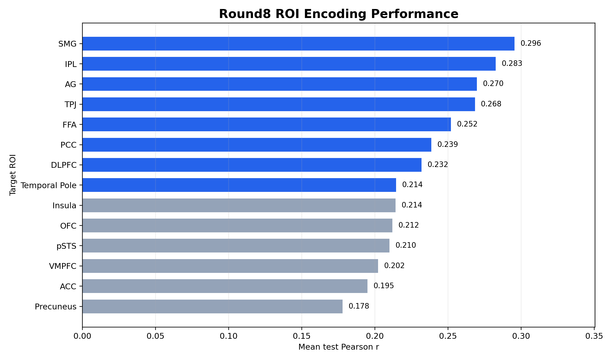
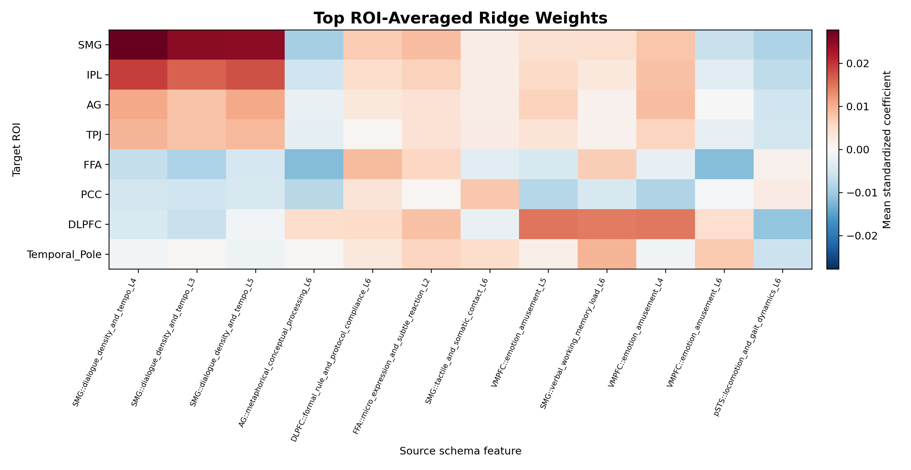
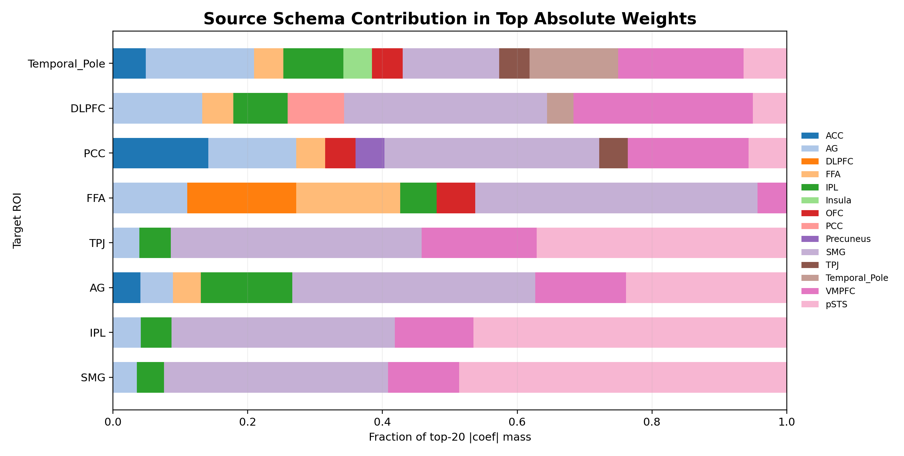
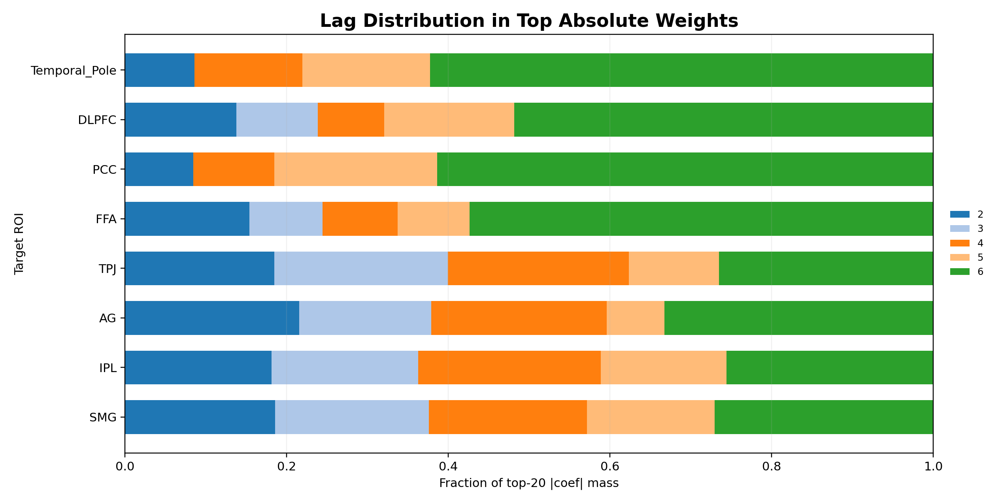

# Friends round8 encoding interpretability report

这份报告是当前 round8 `145train_10test` encoding snapshot 的探索性解释分析。它读取已有 Ridge encoding 输出、ROI schema 和 held-out test split 的 TR-level features，不重跑 scoring，也不重跑 encoding。

## Scope

- Encoding snapshot: `friends/analysis/train_size_sweep_20260629_round8/encoding_145train_10test_snapshot`
- Schema / manifest source: `friends/full_runs/friends_full_scoring_start_14roi_gemini35_20260612/encoding`
- Subject: `sub-01`
- Test episodes in this snapshot: `s06e01a, s06e01b, s06e02a, s06e03a, s06e03b, s06e04a, s06e05a, s06e05b, s06e06a, s06e06b`
- Interpretation target: top 8 ROI by mean test Pearson.
- Weight unit: ROI-averaged standardized Ridge coefficient.

## Method summary

- ROI ranking 使用 `group_summary.json` 中的 `mean_subject_mean_test_pearson`。
- 对每个 target ROI，只聚合该 ROI retained parcels 的 Ridge 系数。
- Positive ranking 使用 `mean(coef)`，negative ranking 使用 `mean(coef)` 的最小值，absolute ranking 使用 `mean(abs(coef))`。
- 每个 feature 都追溯到 `source schema ROI`、`domain`、`dimension_id`、`lag` 和 schema definition。
- Test examples 只从 held-out test split 选择；对于 `lag L` 的 feature，示例文本来自 `target TR - L` 对应的 source ROI `tr_features.jsonl`。

## Figures

## Overall ROI performance

| Rank | ROI | Mean test Pearson | Median test Pearson | Retained parcels |
| --- | --- | --- | --- | --- |
| 1 | SMG | 0.296 | 0.298 | 6 |
| 2 | IPL | 0.283 | 0.239 | 12 |
| 3 | AG | 0.270 | 0.239 | 6 |
| 4 | TPJ | 0.268 | 0.229 | 20 |
| 5 | FFA | 0.252 | 0.276 | 4 |
| 6 | PCC | 0.239 | 0.231 | 6 |
| 7 | DLPFC | 0.232 | 0.208 | 10 |
| 8 | Temporal_Pole | 0.214 | 0.215 | 4 |
| 9 | Insula | 0.214 | 0.216 | 12 |
| 10 | OFC | 0.212 | 0.222 | 12 |
| 11 | pSTS | 0.210 | 0.209 | 4 |
| 12 | VMPFC | 0.202 | 0.163 | 8 |
| 13 | ACC | 0.195 | 0.186 | 8 |
| 14 | Precuneus | 0.178 | 0.142 | 8 |

## Top 8 ROI interpretations

### SMG

- Performance: mean r = `0.296`, median r = `0.298`, retained parcels = `6`.
- Top source schema: `pSTS` (48.6% of top-|coef| mass); self-schema mass: 33.2%.
- Strongest absolute feature: `SMG::dialogue_density_and_tempo` (lag 4, domain `verbal_phonological_tracking`, mean |coef| = 0.0294).

候选解释：这一 ROI 的当前预测权重主要说明哪些 schema feature 在标准化线性模型中有较强预测贡献。如果 top source schema 不是同名 ROI，应该理解为 cross-schema semantic feature contribution，而不是脑区间因果影响。

**Top positive features**

| Rank | Source schema | Feature | Domain | Lag | Mean coef | Mean \|coef\| | Sign consistency | Schema definition |
| --- | --- | --- | --- | --- | --- | --- | --- | --- |
| 1 | SMG | dialogue_density_and_tempo | verbal_phonological_tracking | 4 | 0.0278 | 0.0294 | 0.67 | The density, speed, and overall tempo of spoken dialogue or narration in the scene. |
| 2 | SMG | dialogue_density_and_tempo | verbal_phonological_tracking | 3 | 0.0251 | 0.0278 | 0.67 | The density, speed, and overall tempo of spoken dialogue or narration in the scene. |
| 3 | SMG | dialogue_density_and_tempo | verbal_phonological_tracking | 5 | 0.0249 | 0.0257 | 0.83 | The density, speed, and overall tempo of spoken dialogue or narration in the scene. |
| 4 | pSTS | visible_speech_and_lip_movement | audiovisual_speech_and_communication_integration | 4 | 0.0180 | 0.0181 | 0.83 | The visual prominence of a character actively speaking, where their mouth movements, facial expressions, and lip shapes accompany… |
| 5 | pSTS | vocal_prosody_and_emotional_expression | audiovisual_speech_and_communication_integration | 4 | 0.0180 | 0.0233 | 0.50 | The presence and intensity of emotional inflection, tone, pitch, and volume in spoken words (e.g., whispering in fear, shouting i… |

**Top negative features**

| Rank | Source schema | Feature | Domain | Lag | Mean coef | Mean \|coef\| | Sign consistency | Schema definition |
| --- | --- | --- | --- | --- | --- | --- | --- | --- |
| 1 | TPJ | blame_and_intentionality_assessment | moral_and_normative_appraisal | 2 | -0.0108 | 0.0108 | 1.00 | The degree to which the viewer must evaluate a character's level of blame, intentionality, or negligence behind a harmful outcome… |
| 2 | DLPFC | tactical_planning_and_formulation | strategic_goal_and_plan_tracking | 6 | -0.0106 | 0.0106 | 1.00 | The extent to which characters explicitly formulate, discuss, or negotiate a multi-step, goal-directed plan or tactical maneuver. |
| 3 | IPL | salient_cue_detection | attentional_reorienting_and_salience_detection | 5 | -0.0094 | 0.0095 | 0.83 | Noticing a highly relevant, unexpected, or threatening object, detail, or cue that demands immediate attention. |
| 4 | AG | metaphorical_conceptual_processing | semantic_schema_and_anomaly_resolution | 6 | -0.0092 | 0.0128 | 0.67 | The processing of metaphorical language, highly symbolic dialogue, or abstract concepts that require the viewer to map one domain… |
| 5 | SMG | tactile_and_somatic_contact | somatic_and_pain_resonance | 4 | -0.0089 | 0.0099 | 0.83 | The focus on physical touch, textures, temperature extremes, skin-to-skin contact, or intense somatic sensations. |

**Top absolute features**

| Rank | Source schema | Feature | Domain | Lag | Mean coef | Mean \|coef\| | Sign consistency | Schema definition |
| --- | --- | --- | --- | --- | --- | --- | --- | --- |
| 1 | SMG | dialogue_density_and_tempo | verbal_phonological_tracking | 4 | 0.0278 | 0.0294 | 0.67 | The density, speed, and overall tempo of spoken dialogue or narration in the scene. |
| 2 | SMG | dialogue_density_and_tempo | verbal_phonological_tracking | 3 | 0.0251 | 0.0278 | 0.67 | The density, speed, and overall tempo of spoken dialogue or narration in the scene. |
| 3 | SMG | dialogue_density_and_tempo | verbal_phonological_tracking | 5 | 0.0249 | 0.0257 | 0.83 | The density, speed, and overall tempo of spoken dialogue or narration in the scene. |
| 4 | pSTS | vocal_prosody_and_emotional_expression | audiovisual_speech_and_communication_integration | 4 | 0.0180 | 0.0233 | 0.50 | The presence and intensity of emotional inflection, tone, pitch, and volume in spoken words (e.g., whispering in fear, shouting i… |
| 5 | pSTS | vocal_prosody_and_emotional_expression | audiovisual_speech_and_communication_integration | 3 | 0.0168 | 0.0229 | 0.50 | The presence and intensity of emotional inflection, tone, pitch, and volume in spoken words (e.g., whispering in fear, shouting i… |

**Representative test examples**

| Direction | Episode | Feature | Lag | Score | Error pct | Time | Source description |
| --- | --- | --- | --- | --- | --- | --- | --- |
| positive | s06e04a | SMG::dialogue_density_and_tempo | 4 | 3.76 | 0.0 | 59.6-61.1s | Ross points a finger toward Phoebe and says, "I see what this is. You are in love with Rachel." Phoebe looks at him. |
| negative | s06e01a | TPJ::blame_and_intentionality_assessment | 2 | 2.15 | 0.1 | 62.6-64.1s | Phoebe turns her head back toward the woman at the desk and says, "Well, maybe you wouldn't have if you could run in the chapel." |
| absolute | s06e05a | SMG::dialogue_density_and_tempo | 3 | 3.51 | 0.0 | 411.2-412.7s | Chandler continues, "We have been playing these babies man to man. We" as he gestures with the baby bottle in his right hand. |

### IPL

- Performance: mean r = `0.283`, median r = `0.239`, retained parcels = `12`.
- Top source schema: `pSTS` (46.5% of top-|coef| mass); self-schema mass: 4.6%.
- Strongest absolute feature: `SMG::dialogue_density_and_tempo` (lag 4, domain `verbal_phonological_tracking`, mean |coef| = 0.0252).

候选解释：这一 ROI 的当前预测权重主要说明哪些 schema feature 在标准化线性模型中有较强预测贡献。如果 top source schema 不是同名 ROI，应该理解为 cross-schema semantic feature contribution，而不是脑区间因果影响。

**Top positive features**

| Rank | Source schema | Feature | Domain | Lag | Mean coef | Mean \|coef\| | Sign consistency | Schema definition |
| --- | --- | --- | --- | --- | --- | --- | --- | --- |
| 1 | SMG | dialogue_density_and_tempo | verbal_phonological_tracking | 4 | 0.0191 | 0.0252 | 0.58 | The density, speed, and overall tempo of spoken dialogue or narration in the scene. |
| 2 | SMG | dialogue_density_and_tempo | verbal_phonological_tracking | 5 | 0.0177 | 0.0224 | 0.67 | The density, speed, and overall tempo of spoken dialogue or narration in the scene. |
| 3 | SMG | dialogue_density_and_tempo | verbal_phonological_tracking | 3 | 0.0165 | 0.0231 | 0.58 | The density, speed, and overall tempo of spoken dialogue or narration in the scene. |
| 4 | pSTS | vocal_prosody_and_emotional_expression | audiovisual_speech_and_communication_integration | 3 | 0.0142 | 0.0179 | 0.67 | The presence and intensity of emotional inflection, tone, pitch, and volume in spoken words (e.g., whispering in fear, shouting i… |
| 5 | pSTS | vocal_prosody_and_emotional_expression | audiovisual_speech_and_communication_integration | 4 | 0.0140 | 0.0178 | 0.50 | The presence and intensity of emotional inflection, tone, pitch, and volume in spoken words (e.g., whispering in fear, shouting i… |

**Top negative features**

| Rank | Source schema | Feature | Domain | Lag | Mean coef | Mean \|coef\| | Sign consistency | Schema definition |
| --- | --- | --- | --- | --- | --- | --- | --- | --- |
| 1 | pSTS | dialogue_interactivity_and_turn_taking | social_interaction_tracking | 6 | -0.0093 | 0.0120 | 0.83 | The degree to which the scene features active, back-and-forth verbal communication and conversational turn-taking between charact… |
| 2 | IPL | salient_cue_detection | attentional_reorienting_and_salience_detection | 5 | -0.0080 | 0.0090 | 0.83 | Noticing a highly relevant, unexpected, or threatening object, detail, or cue that demands immediate attention. |
| 3 | DLPFC | tactical_planning_and_formulation | strategic_goal_and_plan_tracking | 6 | -0.0079 | 0.0093 | 0.83 | The extent to which characters explicitly formulate, discuss, or negotiate a multi-step, goal-directed plan or tactical maneuver. |
| 4 | FFA | recurring_character_recognition | character_identity_tracking | 6 | -0.0078 | 0.0086 | 0.92 | The re-entry of an established character after an absence, requiring the viewer to retrieve and match their facial identity. |
| 5 | DLPFC | social_norm_and_tactical_boundary_negotiation | rule_and_normative_constraint_integration | 2 | -0.0074 | 0.0090 | 0.83 | The characters' conscious navigation, negotiation, or manipulation of implicit social norms, etiquette, hierarchy, or high-stakes… |

**Top absolute features**

| Rank | Source schema | Feature | Domain | Lag | Mean coef | Mean \|coef\| | Sign consistency | Schema definition |
| --- | --- | --- | --- | --- | --- | --- | --- | --- |
| 1 | SMG | dialogue_density_and_tempo | verbal_phonological_tracking | 4 | 0.0191 | 0.0252 | 0.58 | The density, speed, and overall tempo of spoken dialogue or narration in the scene. |
| 2 | SMG | dialogue_density_and_tempo | verbal_phonological_tracking | 3 | 0.0165 | 0.0231 | 0.58 | The density, speed, and overall tempo of spoken dialogue or narration in the scene. |
| 3 | SMG | dialogue_density_and_tempo | verbal_phonological_tracking | 5 | 0.0177 | 0.0224 | 0.67 | The density, speed, and overall tempo of spoken dialogue or narration in the scene. |
| 4 | pSTS | vocal_prosody_and_emotional_expression | audiovisual_speech_and_communication_integration | 3 | 0.0142 | 0.0179 | 0.67 | The presence and intensity of emotional inflection, tone, pitch, and volume in spoken words (e.g., whispering in fear, shouting i… |
| 5 | pSTS | vocal_prosody_and_emotional_expression | audiovisual_speech_and_communication_integration | 4 | 0.0140 | 0.0178 | 0.50 | The presence and intensity of emotional inflection, tone, pitch, and volume in spoken words (e.g., whispering in fear, shouting i… |

**Representative test examples**

| Direction | Episode | Feature | Lag | Score | Error pct | Time | Source description |
| --- | --- | --- | --- | --- | --- | --- | --- |
| positive | s06e06b | SMG::dialogue_density_and_tempo | 4 | 4.00 | 0.0 | 83.4-84.9s | Joey looks at his cards and says, "A two and a five." Chandler responds, "You win $50." |
| negative | s06e06b | pSTS::dialogue_interactivity_and_turn_taking | 6 | 4.00 | 0.0 | 80.5-82.0s | Chandler looks at his own cards and says, "I have two queens. What do you have?" |
| absolute | s06e05a | SMG::dialogue_density_and_tempo | 3 | 4.00 | 0.0 | 655.6-657.1s | Chandler says, "Well, I was trying to prove that I was right. And turns out I was wrong. And now it's lodged my throat." He gestures with his hand toward his neck. |

### AG

- Performance: mean r = `0.270`, median r = `0.239`, retained parcels = `6`.
- Top source schema: `SMG` (36.0% of top-|coef| mass); self-schema mass: 4.8%.
- Strongest absolute feature: `SMG::dialogue_density_and_tempo` (lag 4, domain `verbal_phonological_tracking`, mean |coef| = 0.0210).

候选解释：这一 ROI 的当前预测权重主要说明哪些 schema feature 在标准化线性模型中有较强预测贡献。如果 top source schema 不是同名 ROI，应该理解为 cross-schema semantic feature contribution，而不是脑区间因果影响。

**Top positive features**

| Rank | Source schema | Feature | Domain | Lag | Mean coef | Mean \|coef\| | Sign consistency | Schema definition |
| --- | --- | --- | --- | --- | --- | --- | --- | --- |
| 1 | pSTS | vocal_prosody_and_emotional_expression | audiovisual_speech_and_communication_integration | 3 | 0.0116 | 0.0129 | 0.83 | The presence and intensity of emotional inflection, tone, pitch, and volume in spoken words (e.g., whispering in fear, shouting i… |
| 2 | pSTS | vocal_prosody_and_emotional_expression | audiovisual_speech_and_communication_integration | 2 | 0.0114 | 0.0134 | 0.83 | The presence and intensity of emotional inflection, tone, pitch, and volume in spoken words (e.g., whispering in fear, shouting i… |
| 3 | IPL | non_verbal_social_cue_decoding | social_perspective_and_intention_tracking | 6 | 0.0107 | 0.0107 | 1.00 | Interpreting body language, facial expressions, eye contact, and vocal tone to infer social dynamics. |
| 4 | SMG | dialogue_density_and_tempo | verbal_phonological_tracking | 5 | 0.0104 | 0.0191 | 0.50 | The density, speed, and overall tempo of spoken dialogue or narration in the scene. |
| 5 | SMG | dialogue_density_and_tempo | verbal_phonological_tracking | 4 | 0.0104 | 0.0210 | 0.50 | The density, speed, and overall tempo of spoken dialogue or narration in the scene. |

**Top negative features**

| Rank | Source schema | Feature | Domain | Lag | Mean coef | Mean \|coef\| | Sign consistency | Schema definition |
| --- | --- | --- | --- | --- | --- | --- | --- | --- |
| 1 | pSTS | dialogue_interactivity_and_turn_taking | social_interaction_tracking | 6 | -0.0101 | 0.0101 | 1.00 | The degree to which the scene features active, back-and-forth verbal communication and conversational turn-taking between charact… |
| 2 | FFA | recurring_character_recognition | character_identity_tracking | 6 | -0.0094 | 0.0094 | 1.00 | The re-entry of an established character after an absence, requiring the viewer to retrieve and match their facial identity. |
| 3 | DLPFC | social_norm_and_tactical_boundary_negotiation | rule_and_normative_constraint_integration | 2 | -0.0090 | 0.0090 | 1.00 | The characters' conscious navigation, negotiation, or manipulation of implicit social norms, etiquette, hierarchy, or high-stakes… |
| 4 | VMPFC | prosocial_altruism | social_moral_appraisal | 6 | -0.0081 | 0.0081 | 1.00 | The viewer's appraisal of a character's actions as highly prosocial, altruistic, cooperative, or morally exemplary, upholding soc… |
| 5 | ACC | expectancy_violation_and_surprise | cognitive_conflict_and_expectancy_monitoring | 6 | -0.0081 | 0.0081 | 1.00 | The occurrence of sudden plot twists, unexpected events, or mismatches with established predictions that surprise the characters… |

**Top absolute features**

| Rank | Source schema | Feature | Domain | Lag | Mean coef | Mean \|coef\| | Sign consistency | Schema definition |
| --- | --- | --- | --- | --- | --- | --- | --- | --- |
| 1 | SMG | dialogue_density_and_tempo | verbal_phonological_tracking | 4 | 0.0104 | 0.0210 | 0.50 | The density, speed, and overall tempo of spoken dialogue or narration in the scene. |
| 2 | SMG | dialogue_density_and_tempo | verbal_phonological_tracking | 5 | 0.0104 | 0.0191 | 0.50 | The density, speed, and overall tempo of spoken dialogue or narration in the scene. |
| 3 | SMG | dialogue_density_and_tempo | verbal_phonological_tracking | 3 | 0.0078 | 0.0185 | 0.50 | The density, speed, and overall tempo of spoken dialogue or narration in the scene. |
| 4 | SMG | dialogue_density_and_tempo | verbal_phonological_tracking | 6 | 0.0041 | 0.0151 | 0.50 | The density, speed, and overall tempo of spoken dialogue or narration in the scene. |
| 5 | IPL | goal_directed_action_sequences | action_simulation_and_tool_tracking | 6 | 0.0083 | 0.0135 | 0.83 | Tracking a sequence of physical actions organized to achieve a specific, immediate physical goal. |

**Representative test examples**

| Direction | Episode | Feature | Lag | Score | Error pct | Time | Source description |
| --- | --- | --- | --- | --- | --- | --- | --- |
| positive | s06e05b | pSTS::vocal_prosody_and_emotional_expression | 3 | 4.00 | 0.1 | 345.7-347.2s | Phoebe looks at the babies and says, "We ain't taking care of you with no, huh? You guys feel safe, right? Okay, I'm gonna take that spitbubble." She uses a cloth to wipe a baby’s… |
| negative | s06e03b | pSTS::dialogue_interactivity_and_turn_taking | 6 | 4.00 | 0.0 | 114.7-116.2s | Ross stands still, holding more books. "What do you mean they're not moving in? They're still moving in, right?" he asks, his volume lower than Rachel's. |
| absolute | s06e03b | SMG::dialogue_density_and_tempo | 4 | 3.00 | 0.1 | 116.2-117.7s | Ross stands still, holding more books. "What do you mean they're not moving in? They're still moving in, right?" he asks, his volume lower than Rachel's. |

### TPJ

- Performance: mean r = `0.268`, median r = `0.229`, retained parcels = `20`.
- Top source schema: `SMG` (37.3% of top-|coef| mass); self-schema mass: 0.0%.
- Strongest absolute feature: `SMG::dialogue_density_and_tempo` (lag 4, domain `verbal_phonological_tracking`, mean |coef| = 0.0212).

候选解释：这一 ROI 的当前预测权重主要说明哪些 schema feature 在标准化线性模型中有较强预测贡献。如果 top source schema 不是同名 ROI，应该理解为 cross-schema semantic feature contribution，而不是脑区间因果影响。

**Top positive features**

| Rank | Source schema | Feature | Domain | Lag | Mean coef | Mean \|coef\| | Sign consistency | Schema definition |
| --- | --- | --- | --- | --- | --- | --- | --- | --- |
| 1 | pSTS | vocal_prosody_and_emotional_expression | audiovisual_speech_and_communication_integration | 3 | 0.0095 | 0.0137 | 0.65 | The presence and intensity of emotional inflection, tone, pitch, and volume in spoken words (e.g., whispering in fear, shouting i… |
| 2 | SMG | dialogue_density_and_tempo | verbal_phonological_tracking | 4 | 0.0094 | 0.0212 | 0.60 | The density, speed, and overall tempo of spoken dialogue or narration in the scene. |
| 3 | SMG | dialogue_density_and_tempo | verbal_phonological_tracking | 5 | 0.0090 | 0.0184 | 0.50 | The density, speed, and overall tempo of spoken dialogue or narration in the scene. |
| 4 | pSTS | vocal_prosody_and_emotional_expression | audiovisual_speech_and_communication_integration | 4 | 0.0088 | 0.0138 | 0.50 | The presence and intensity of emotional inflection, tone, pitch, and volume in spoken words (e.g., whispering in fear, shouting i… |
| 5 | pSTS | vocal_prosody_and_emotional_expression | audiovisual_speech_and_communication_integration | 2 | 0.0088 | 0.0127 | 0.65 | The presence and intensity of emotional inflection, tone, pitch, and volume in spoken words (e.g., whispering in fear, shouting i… |

**Top negative features**

| Rank | Source schema | Feature | Domain | Lag | Mean coef | Mean \|coef\| | Sign consistency | Schema definition |
| --- | --- | --- | --- | --- | --- | --- | --- | --- |
| 1 | pSTS | dialogue_interactivity_and_turn_taking | social_interaction_tracking | 6 | -0.0070 | 0.0101 | 0.80 | The degree to which the scene features active, back-and-forth verbal communication and conversational turn-taking between charact… |
| 2 | ACC | expectancy_violation_and_surprise | cognitive_conflict_and_expectancy_monitoring | 6 | -0.0060 | 0.0071 | 0.90 | The occurrence of sudden plot twists, unexpected events, or mismatches with established predictions that surprise the characters… |
| 3 | VMPFC | prosocial_altruism | social_moral_appraisal | 6 | -0.0059 | 0.0068 | 0.85 | The viewer's appraisal of a character's actions as highly prosocial, altruistic, cooperative, or morally exemplary, upholding soc… |
| 4 | TPJ | blame_and_intentionality_assessment | moral_and_normative_appraisal | 2 | -0.0055 | 0.0072 | 0.75 | The degree to which the viewer must evaluate a character's level of blame, intentionality, or negligence behind a harmful outcome… |
| 5 | SMG | unexpected_narrative_intrusions | attentional_reorienting_and_spatial_salience | 6 | -0.0055 | 0.0098 | 0.75 | The sudden, unexpected introduction of a new character, object, or event that interrupts the ongoing narrative flow and demands i… |

**Top absolute features**

| Rank | Source schema | Feature | Domain | Lag | Mean coef | Mean \|coef\| | Sign consistency | Schema definition |
| --- | --- | --- | --- | --- | --- | --- | --- | --- |
| 1 | SMG | dialogue_density_and_tempo | verbal_phonological_tracking | 4 | 0.0094 | 0.0212 | 0.60 | The density, speed, and overall tempo of spoken dialogue or narration in the scene. |
| 2 | SMG | dialogue_density_and_tempo | verbal_phonological_tracking | 3 | 0.0079 | 0.0199 | 0.60 | The density, speed, and overall tempo of spoken dialogue or narration in the scene. |
| 3 | SMG | dialogue_density_and_tempo | verbal_phonological_tracking | 5 | 0.0090 | 0.0184 | 0.50 | The density, speed, and overall tempo of spoken dialogue or narration in the scene. |
| 4 | SMG | dialogue_density_and_tempo | verbal_phonological_tracking | 2 | 0.0046 | 0.0154 | 0.55 | The density, speed, and overall tempo of spoken dialogue or narration in the scene. |
| 5 | SMG | dialogue_density_and_tempo | verbal_phonological_tracking | 6 | 0.0038 | 0.0140 | 0.60 | The density, speed, and overall tempo of spoken dialogue or narration in the scene. |

**Representative test examples**

| Direction | Episode | Feature | Lag | Score | Error pct | Time | Source description |
| --- | --- | --- | --- | --- | --- | --- | --- |
| positive | s06e06b | pSTS::vocal_prosody_and_emotional_expression | 3 | 5.00 | 0.0 | 420.2-421.7s | Ross says, "He's fine. Yeah, he's right oh, my God." He turns his head to the left toward a striped sweater stuffed with an object. Audience laughter is audible. |
| negative | s06e06b | pSTS::dialogue_interactivity_and_turn_taking | 6 | 3.00 | 0.0 | 691.4-692.9s | Chandler takes several cards and says, "Okay? Now, I assume the saucer card came up when you played last," his gaze on the cards. |
| absolute | s06e06b | SMG::dialogue_density_and_tempo | 4 | 4.00 | 0.2 | 83.4-84.9s | Joey looks at his cards and says, "A two and a five." Chandler responds, "You win $50." |

### FFA

- Performance: mean r = `0.252`, median r = `0.276`, retained parcels = `4`.
- Top source schema: `SMG` (41.9% of top-|coef| mass); self-schema mass: 15.4%.
- Strongest absolute feature: `AG::metaphorical_conceptual_processing` (lag 6, domain `semantic_schema_and_anomaly_resolution`, mean |coef| = 0.0193).

候选解释：这一 ROI 的当前预测权重主要说明哪些 schema feature 在标准化线性模型中有较强预测贡献。如果 top source schema 不是同名 ROI，应该理解为 cross-schema semantic feature contribution，而不是脑区间因果影响。

**Top positive features**

| Rank | Source schema | Feature | Domain | Lag | Mean coef | Mean \|coef\| | Sign consistency | Schema definition |
| --- | --- | --- | --- | --- | --- | --- | --- | --- |
| 1 | DLPFC | formal_rule_and_protocol_compliance | rule_and_normative_constraint_integration | 6 | 0.0088 | 0.0180 | 0.75 | The extent to which characters must navigate, comply with, or enforce explicit, formal rules, laws, regulations, or operational p… |
| 2 | Temporal_Pole | long_term_plot_integration | narrative_schema_and_coherence_integration | 6 | 0.0084 | 0.0085 | 0.75 | The degree to which the current scene serves as a critical junction that connects, resolves, or advances long-term, overarching p… |
| 3 | OFC | strategic_uncertainty_and_suspense | viewer_risk_and_uncertainty_assessment | 6 | 0.0082 | 0.0162 | 0.75 | The unpredictability of outcomes, high-stakes decision-making under uncertainty, or intense suspense regarding what will happen n… |
| 4 | pSTS | dialogue_interactivity_and_turn_taking | social_interaction_tracking | 6 | 0.0073 | 0.0073 | 1.00 | The degree to which the scene features active, back-and-forth verbal communication and conversational turn-taking between charact… |
| 5 | IPL | goal_directed_action_sequences | action_simulation_and_tool_tracking | 6 | 0.0073 | 0.0152 | 0.75 | Tracking a sequence of physical actions organized to achieve a specific, immediate physical goal. |

**Top negative features**

| Rank | Source schema | Feature | Domain | Lag | Mean coef | Mean \|coef\| | Sign consistency | Schema definition |
| --- | --- | --- | --- | --- | --- | --- | --- | --- |
| 1 | AG | metaphorical_conceptual_processing | semantic_schema_and_anomaly_resolution | 6 | -0.0120 | 0.0193 | 0.50 | The processing of metaphorical language, highly symbolic dialogue, or abstract concepts that require the viewer to map one domain… |
| 2 | VMPFC | emotion_amusement | emotion_experience | 6 | -0.0119 | 0.0122 | 0.75 | Inferred feeling of lighthearted humor, playfulness, or laughter triggered by funny, absurd, or witty narrative elements. |
| 3 | SMG | dialogue_density_and_tempo | verbal_phonological_tracking | 2 | -0.0105 | 0.0143 | 0.75 | The density, speed, and overall tempo of spoken dialogue or narration in the scene. |
| 4 | OFC | social_faux_pas_and_awkwardness | viewer_social_norm_appraisal | 6 | -0.0092 | 0.0092 | 1.00 | The occurrence of minor social transgressions, awkward interactions, embarrassing moments, or violations of polite etiquette. |
| 5 | SMG | dialogue_density_and_tempo | verbal_phonological_tracking | 3 | -0.0087 | 0.0137 | 0.75 | The density, speed, and overall tempo of spoken dialogue or narration in the scene. |

**Top absolute features**

| Rank | Source schema | Feature | Domain | Lag | Mean coef | Mean \|coef\| | Sign consistency | Schema definition |
| --- | --- | --- | --- | --- | --- | --- | --- | --- |
| 1 | AG | metaphorical_conceptual_processing | semantic_schema_and_anomaly_resolution | 6 | -0.0120 | 0.0193 | 0.50 | The processing of metaphorical language, highly symbolic dialogue, or abstract concepts that require the viewer to map one domain… |
| 2 | DLPFC | formal_rule_and_protocol_compliance | rule_and_normative_constraint_integration | 6 | 0.0088 | 0.0180 | 0.75 | The extent to which characters must navigate, comply with, or enforce explicit, formal rules, laws, regulations, or operational p… |
| 3 | FFA | micro_expression_and_subtle_reaction | facial_expression_and_gaze_decoding | 2 | 0.0058 | 0.0170 | 0.75 | Subtle, fleeting, or micro-facial expressions that convey hidden emotions, deceit, or internal conflict. |
| 4 | OFC | strategic_uncertainty_and_suspense | viewer_risk_and_uncertainty_assessment | 6 | 0.0082 | 0.0162 | 0.75 | The unpredictability of outcomes, high-stakes decision-making under uncertainty, or intense suspense regarding what will happen n… |
| 5 | DLPFC | goal_progress_monitoring | strategic_goal_and_plan_tracking | 6 | 0.0045 | 0.0155 | 0.75 | The viewer's active tracking of a character's progress, setbacks, or adjustments toward a long-term, established objective. |

**Representative test examples**

| Direction | Episode | Feature | Lag | Score | Error pct | Time | Source description |
| --- | --- | --- | --- | --- | --- | --- | --- |
| positive | s06e01a | DLPFC::formal_rule_and_protocol_compliance | 6 | 4.00 | 0.1 | 667.5-669.0s | Monica continues, "...a clear-cut, significant..." as they reach the elevator. |
| negative | s06e05a | AG::metaphorical_conceptual_processing | 6 | 1.00 | 0.0 | 530.4-531.9s | The man asks, "You got a place upstate?" Joey nods and says, "Sure." Joey has a wet spot on the chest of his gray shirt. |
| absolute | s06e01b | FFA::micro_expression_and_subtle_reaction | 2 | 3.00 | 0.0 | 263.7-265.2s | Joey says, "Don't you think I asked him that before he got in?" Phoebe looks back at Joey and says, "You know what?" |

### PCC

- Performance: mean r = `0.239`, median r = `0.231`, retained parcels = `6`.
- Top source schema: `SMG` (31.9% of top-|coef| mass); self-schema mass: 0.0%.
- Strongest absolute feature: `SMG::tactile_and_somatic_contact` (lag 6, domain `somatic_and_pain_resonance`, mean |coef| = 0.0176).

候选解释：这一 ROI 的当前预测权重主要说明哪些 schema feature 在标准化线性模型中有较强预测贡献。如果 top source schema 不是同名 ROI，应该理解为 cross-schema semantic feature contribution，而不是脑区间因果影响。

**Top positive features**

| Rank | Source schema | Feature | Domain | Lag | Mean coef | Mean \|coef\| | Sign consistency | Schema definition |
| --- | --- | --- | --- | --- | --- | --- | --- | --- |
| 1 | OFC | politeness_and_normative_compliance | viewer_social_norm_appraisal | 6 | 0.0100 | 0.0106 | 0.83 | The explicit adherence to social etiquette, respect, politeness, or cultural rituals and norms. |
| 2 | AG | metaphorical_conceptual_processing | semantic_schema_and_anomaly_resolution | 2 | 0.0095 | 0.0095 | 1.00 | The processing of metaphorical language, highly symbolic dialogue, or abstract concepts that require the viewer to map one domain… |
| 3 | SMG | tactile_and_somatic_contact | somatic_and_pain_resonance | 6 | 0.0075 | 0.0176 | 0.67 | The focus on physical touch, textures, temperature extremes, skin-to-skin contact, or intense somatic sensations. |
| 4 | AG | causal_plot_linking | narrative_coherence_integration | 5 | 0.0074 | 0.0111 | 0.67 | The degree to which the current scene requires the viewer to connect ongoing events to prior plot points, tracking causal chains… |
| 5 | Insula | interpersonal_hostility_and_confrontation | socio_emotional_conflict_and_tension | 2 | 0.0065 | 0.0067 | 0.83 | Direct, active verbal or physical confrontation, arguments, or overt hostility between characters. |

**Top negative features**

| Rank | Source schema | Feature | Domain | Lag | Mean coef | Mean \|coef\| | Sign consistency | Schema definition |
| --- | --- | --- | --- | --- | --- | --- | --- | --- |
| 1 | TPJ | communicative_intent_and_dialogue_dynamics | social_interaction_appraisal | 6 | -0.0110 | 0.0113 | 0.83 | The complexity of the communication between characters, focusing on subtext, non-verbal social cues, sarcasm, or reading between… |
| 2 | OFC | politeness_and_normative_compliance | viewer_social_norm_appraisal | 2 | -0.0090 | 0.0090 | 1.00 | The explicit adherence to social etiquette, respect, politeness, or cultural rituals and norms. |
| 3 | SMG | dialogue_density_and_tempo | verbal_phonological_tracking | 6 | -0.0087 | 0.0110 | 0.83 | The density, speed, and overall tempo of spoken dialogue or narration in the scene. |
| 4 | TPJ | communicative_intent_and_dialogue_dynamics | social_interaction_appraisal | 5 | -0.0086 | 0.0094 | 0.83 | The complexity of the communication between characters, focusing on subtext, non-verbal social cues, sarcasm, or reading between… |
| 5 | VMPFC | emotion_amusement | emotion_experience | 4 | -0.0084 | 0.0153 | 0.50 | Inferred feeling of lighthearted humor, playfulness, or laughter triggered by funny, absurd, or witty narrative elements. |

**Top absolute features**

| Rank | Source schema | Feature | Domain | Lag | Mean coef | Mean \|coef\| | Sign consistency | Schema definition |
| --- | --- | --- | --- | --- | --- | --- | --- | --- |
| 1 | SMG | tactile_and_somatic_contact | somatic_and_pain_resonance | 6 | 0.0075 | 0.0176 | 0.67 | The focus on physical touch, textures, temperature extremes, skin-to-skin contact, or intense somatic sensations. |
| 2 | VMPFC | emotion_amusement | emotion_experience | 5 | -0.0080 | 0.0170 | 0.50 | Inferred feeling of lighthearted humor, playfulness, or laughter triggered by funny, absurd, or witty narrative elements. |
| 3 | SMG | verbal_working_memory_load | verbal_phonological_tracking | 6 | -0.0045 | 0.0160 | 0.50 | The cognitive complexity of the spoken language, requiring the listener (and viewer) to hold complex verbal information, technica… |
| 4 | VMPFC | emotion_amusement | emotion_experience | 6 | -0.0006 | 0.0157 | 0.50 | Inferred feeling of lighthearted humor, playfulness, or laughter triggered by funny, absurd, or witty narrative elements. |
| 5 | VMPFC | emotion_amusement | emotion_experience | 4 | -0.0084 | 0.0153 | 0.50 | Inferred feeling of lighthearted humor, playfulness, or laughter triggered by funny, absurd, or witty narrative elements. |

**Representative test examples**

| Direction | Episode | Feature | Lag | Score | Error pct | Time | Source description |
| --- | --- | --- | --- | --- | --- | --- | --- |
| positive | s06e03b | OFC::politeness_and_normative_compliance | 6 | 1.00 | 0.0 | 436.6-438.1s | Monica leads Chandler into the living room area toward a rug. |
| negative | s06e05a | TPJ::communicative_intent_and_dialogue_dynamics | 6 | 5.00 | 0.0 | 524.5-526.0s | Joey says, "And that's just in the city. I get her up to 160 when I take her upstate." The man responds, "Really?" |
| absolute | s06e05a | SMG::tactile_and_somatic_contact | 6 | 4.00 | 0.0 | 524.5-526.0s | Joey says, "And that's just in the city. I get her up to 160 when I take her upstate." The man responds, "Really?" |

### DLPFC

- Performance: mean r = `0.232`, median r = `0.208`, retained parcels = `10`.
- Top source schema: `SMG` (30.1% of top-|coef| mass); self-schema mass: 0.0%.
- Strongest absolute feature: `VMPFC::emotion_amusement` (lag 4, domain `emotion_experience`, mean |coef| = 0.0204).

候选解释：这一 ROI 的当前预测权重主要说明哪些 schema feature 在标准化线性模型中有较强预测贡献。如果 top source schema 不是同名 ROI，应该理解为 cross-schema semantic feature contribution，而不是脑区间因果影响。

**Top positive features**

| Rank | Source schema | Feature | Domain | Lag | Mean coef | Mean \|coef\| | Sign consistency | Schema definition |
| --- | --- | --- | --- | --- | --- | --- | --- | --- |
| 1 | VMPFC | emotion_amusement | emotion_experience | 5 | 0.0149 | 0.0197 | 0.80 | Inferred feeling of lighthearted humor, playfulness, or laughter triggered by funny, absurd, or witty narrative elements. |
| 2 | VMPFC | emotion_amusement | emotion_experience | 4 | 0.0147 | 0.0204 | 0.80 | Inferred feeling of lighthearted humor, playfulness, or laughter triggered by funny, absurd, or witty narrative elements. |
| 3 | SMG | verbal_working_memory_load | verbal_phonological_tracking | 6 | 0.0143 | 0.0177 | 0.80 | The cognitive complexity of the spoken language, requiring the listener (and viewer) to hold complex verbal information, technica… |
| 4 | SMG | dialogue_density_and_tempo | verbal_phonological_tracking | 6 | 0.0133 | 0.0133 | 1.00 | The density, speed, and overall tempo of spoken dialogue or narration in the scene. |
| 5 | VMPFC | emotion_amusement | emotion_experience | 3 | 0.0102 | 0.0152 | 0.70 | Inferred feeling of lighthearted humor, playfulness, or laughter triggered by funny, absurd, or witty narrative elements. |

**Top negative features**

| Rank | Source schema | Feature | Domain | Lag | Mean coef | Mean \|coef\| | Sign consistency | Schema definition |
| --- | --- | --- | --- | --- | --- | --- | --- | --- |
| 1 | AG | social_relationship_dynamics | social_mentalizing | 6 | -0.0120 | 0.0122 | 0.90 | Tracking the unstated tension, power struggles, alliances, or shifting emotional bonds between characters. |
| 2 | pSTS | locomotion_and_gait_dynamics | biological_motion_and_action_intent_appraisal | 6 | -0.0110 | 0.0124 | 0.80 | The physical manner of walking, running, or moving through space, conveying intent, urgency, or physical state (e.g., sneaking, s… |
| 3 | SMG | dialogue_density_and_tempo | verbal_phonological_tracking | 2 | -0.0108 | 0.0127 | 0.70 | The density, speed, and overall tempo of spoken dialogue or narration in the scene. |
| 4 | PCC | social_tension_and_subtext | social_relationship_and_mentalizing_appraisal | 6 | -0.0096 | 0.0108 | 0.80 | The presence of unexpressed social friction, power struggles, or underlying tension in dialogue and non-verbal communication. |
| 5 | DLPFC | prediction_error_and_model_updating | cognitive_conflict_and_hypothesis_testing | 6 | -0.0096 | 0.0096 | 1.00 | The viewer's cognitive process of revising their mental model of the plot, characters, or world in response to a sudden plot twis… |

**Top absolute features**

| Rank | Source schema | Feature | Domain | Lag | Mean coef | Mean \|coef\| | Sign consistency | Schema definition |
| --- | --- | --- | --- | --- | --- | --- | --- | --- |
| 1 | VMPFC | emotion_amusement | emotion_experience | 4 | 0.0147 | 0.0204 | 0.80 | Inferred feeling of lighthearted humor, playfulness, or laughter triggered by funny, absurd, or witty narrative elements. |
| 2 | VMPFC | emotion_amusement | emotion_experience | 5 | 0.0149 | 0.0197 | 0.80 | Inferred feeling of lighthearted humor, playfulness, or laughter triggered by funny, absurd, or witty narrative elements. |
| 3 | SMG | verbal_working_memory_load | verbal_phonological_tracking | 6 | 0.0143 | 0.0177 | 0.80 | The cognitive complexity of the spoken language, requiring the listener (and viewer) to hold complex verbal information, technica… |
| 4 | VMPFC | emotion_amusement | emotion_experience | 3 | 0.0102 | 0.0152 | 0.70 | Inferred feeling of lighthearted humor, playfulness, or laughter triggered by funny, absurd, or witty narrative elements. |
| 5 | SMG | dialogue_density_and_tempo | verbal_phonological_tracking | 6 | 0.0133 | 0.0133 | 1.00 | The density, speed, and overall tempo of spoken dialogue or narration in the scene. |

**Representative test examples**

| Direction | Episode | Feature | Lag | Score | Error pct | Time | Source description |
| --- | --- | --- | --- | --- | --- | --- | --- |
| positive | s06e06b | VMPFC::emotion_amusement | 5 | 4.00 | 0.0 | 685.4-686.9s | Ross says, "But I should warn you, I am," as he reaches into his pocket. |
| negative | s06e01a | AG::social_relationship_dynamics | 6 | 5.00 | 0.1 | 517.0-518.5s | Joey continues, "Ross, I don't think surgery is the answer," holding his hand up with his palm facing Ross. |
| absolute | s06e06b | VMPFC::emotion_amusement | 4 | 4.17 | 0.0 | 418.7-420.2s | Ross says, "He's fine. Yeah, he's right oh, my God." He turns his head to the left toward a striped sweater stuffed with an object. Audience laughter is audible. |

### Temporal_Pole

- Performance: mean r = `0.214`, median r = `0.215`, retained parcels = `4`.
- Top source schema: `VMPFC` (18.6% of top-|coef| mass); self-schema mass: 13.1%.
- Strongest absolute feature: `VMPFC::emotion_amusement` (lag 6, domain `emotion_experience`, mean |coef| = 0.0200).

候选解释：这一 ROI 的当前预测权重主要说明哪些 schema feature 在标准化线性模型中有较强预测贡献。如果 top source schema 不是同名 ROI，应该理解为 cross-schema semantic feature contribution，而不是脑区间因果影响。

**Top positive features**

| Rank | Source schema | Feature | Domain | Lag | Mean coef | Mean \|coef\| | Sign consistency | Schema definition |
| --- | --- | --- | --- | --- | --- | --- | --- | --- |
| 1 | AG | causal_plot_linking | narrative_coherence_integration | 5 | 0.0098 | 0.0139 | 0.50 | The degree to which the current scene requires the viewer to connect ongoing events to prior plot points, tracking causal chains… |
| 2 | AG | causal_plot_linking | narrative_coherence_integration | 4 | 0.0097 | 0.0101 | 0.75 | The degree to which the current scene requires the viewer to connect ongoing events to prior plot points, tracking causal chains… |
| 3 | SMG | verbal_working_memory_load | verbal_phonological_tracking | 6 | 0.0094 | 0.0123 | 0.75 | The cognitive complexity of the spoken language, requiring the listener (and viewer) to hold complex verbal information, technica… |
| 4 | ACC | time_pressure_and_deadlines | motivational_salience_and_urgency_tracking | 6 | 0.0090 | 0.0090 | 1.00 | The presence of strict time limits, ticking clocks, or rapid pacing that forces characters to act with extreme urgency. |
| 5 | VMPFC | emotion_amusement | emotion_experience | 6 | 0.0072 | 0.0200 | 0.75 | Inferred feeling of lighthearted humor, playfulness, or laughter triggered by funny, absurd, or witty narrative elements. |

**Top negative features**

| Rank | Source schema | Feature | Domain | Lag | Mean coef | Mean \|coef\| | Sign consistency | Schema definition |
| --- | --- | --- | --- | --- | --- | --- | --- | --- |
| 1 | AG | social_relationship_dynamics | social_mentalizing | 6 | -0.0080 | 0.0089 | 0.75 | Tracking the unstated tension, power struggles, alliances, or shifting emotional bonds between characters. |
| 2 | DLPFC | temporal_thread_integration | narrative_working_memory_and_causal_integration | 2 | -0.0072 | 0.0072 | 1.00 | The viewer's active cognitive maintenance and integration of temporally distant narrative threads, past backstories, or flashback… |
| 3 | ACC | sudden_dramatic_shifts | motivational_salience_and_urgency_tracking | 2 | -0.0069 | 0.0069 | 1.00 | Abrupt, unexpected changes in the scene's tone, pacing, or environment that break the narrative flow and demand immediate attenti… |
| 4 | FFA | human_agent_action | animacy_and_social_presence | 2 | -0.0067 | 0.0092 | 0.75 | The presence and visual focus on human or human-like agents performing physical actions, emphasizing biological motion and animac… |
| 5 | ACC | outcome_uncertainty_and_suspense | appraised_effort_and_action_outcomes | 6 | -0.0066 | 0.0125 | 0.75 | The degree of suspense and uncertainty surrounding whether a character's high-stakes action will succeed or fail. |

**Top absolute features**

| Rank | Source schema | Feature | Domain | Lag | Mean coef | Mean \|coef\| | Sign consistency | Schema definition |
| --- | --- | --- | --- | --- | --- | --- | --- | --- |
| 1 | VMPFC | emotion_amusement | emotion_experience | 6 | 0.0072 | 0.0200 | 0.75 | Inferred feeling of lighthearted humor, playfulness, or laughter triggered by funny, absurd, or witty narrative elements. |
| 2 | pSTS | locomotion_and_gait_dynamics | biological_motion_and_action_intent_appraisal | 6 | -0.0059 | 0.0164 | 0.75 | The physical manner of walking, running, or moving through space, conveying intent, urgency, or physical state (e.g., sneaking, s… |
| 3 | VMPFC | emotion_amusement | emotion_experience | 5 | 0.0016 | 0.0157 | 0.75 | Inferred feeling of lighthearted humor, playfulness, or laughter triggered by funny, absurd, or witty narrative elements. |
| 4 | AG | causal_plot_linking | narrative_coherence_integration | 6 | 0.0063 | 0.0151 | 0.50 | The degree to which the current scene requires the viewer to connect ongoing events to prior plot points, tracking causal chains… |
| 5 | AG | causal_plot_linking | narrative_coherence_integration | 5 | 0.0098 | 0.0139 | 0.50 | The degree to which the current scene requires the viewer to connect ongoing events to prior plot points, tracking causal chains… |

**Representative test examples**

| Direction | Episode | Feature | Lag | Score | Error pct | Time | Source description |
| --- | --- | --- | --- | --- | --- | --- | --- |
| positive | s06e06b | AG::causal_plot_linking | 5 | 5.00 | 0.0 | 102.8-104.3s | Joey looks down at the counter and says, "Damn, I am good at cups." |
| negative | s06e06b | AG::social_relationship_dynamics | 6 | 5.00 | 0.0 | 101.3-102.8s | Joey looks at the cards in Chandler's hand. Audience laughter is audible. |
| absolute | s06e06b | VMPFC::emotion_amusement | 6 | 6.00 | 0.0 | 101.3-102.8s | Joey looks at the cards in Chandler's hand. Audience laughter is audible. |

## Cross-ROI notes

- `source schema contribution` 图只统计每个 target ROI 的 top-20 absolute features；它适合看解释主导来源，不适合当作全特征空间的严格方差分解。
- `lag distribution` 同样基于 top-20 absolute features；当前 lags 为 2-6 TR，对应约 3.0-8.9 秒的过去语义信息。
- sign consistency 低的 feature 表示它在同一 ROI 的不同 parcels 上方向不一致；这类 feature 可称为强但异质，不应写成统一的 ROI-level direction。

## Limitations

- 当前结果来自 `sub-01` 和尚未 final 的 round8 encoding snapshot；结论应写作候选解释。
- Ridge coefficient 是标准化线性预测权重，不是因果归因。
- 多个 schema feature 可能高度相关，单个 feature 的权重会受共线性和 Ridge regularization 影响。
- 本版按要求未做 permutation importance 或 drop-one ablation；这些应放到 final encoding 稳定后再做。
- cross-schema contribution 表示 feature schema 来源，不表示 source ROI 对 target ROI 的神经因果作用。

## Output files

- `tables/roi_performance.csv`
- `tables/top_positive_weights.csv`
- `tables/top_negative_weights.csv`
- `tables/top_absolute_weights.csv`
- `tables/source_schema_contribution.csv`
- `tables/lag_distribution.csv`
- `tables/representative_test_examples.csv`
- `interpretability_summary.json`
